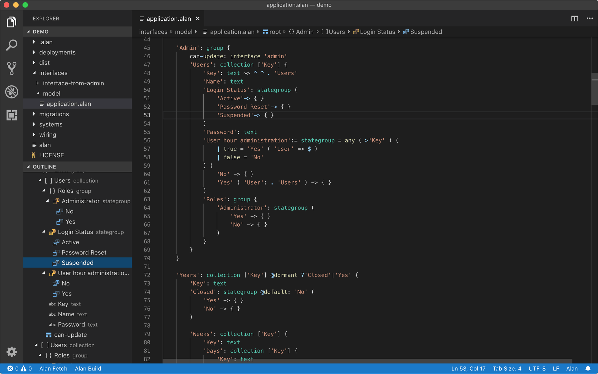

# Alan extension for VS Code

Provides tasks definitions, syntax highlighting, naive support for goto/peek definition, and a tree view for Alan files.

## Tasks

The build and fetch tasks can be started from within a `.alan` file.
The extension resolves the nearest `alan` script for the current file, so you can work on multiple projects in a single workspace.

Running the package task requires that you open the `connections.alan` file of the deployment that you want to package.

## Build Status

